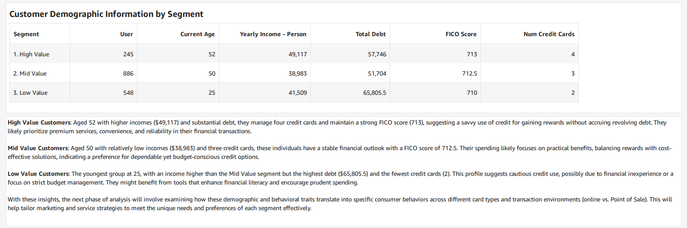
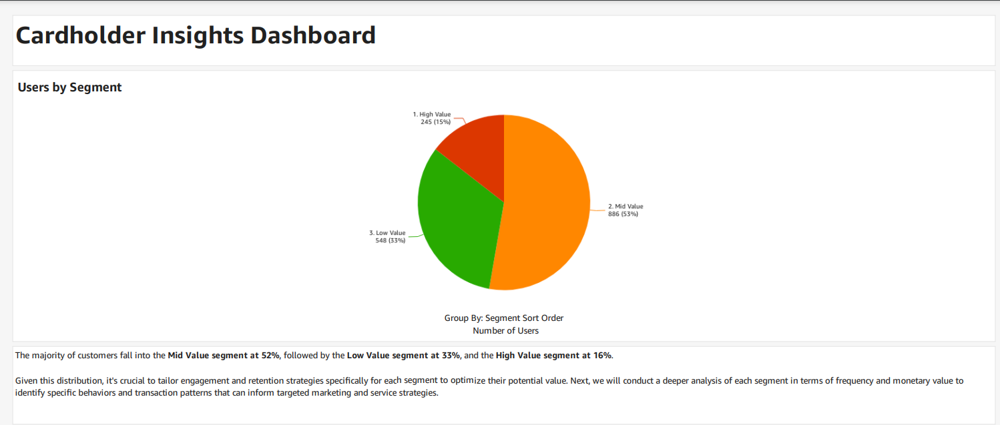
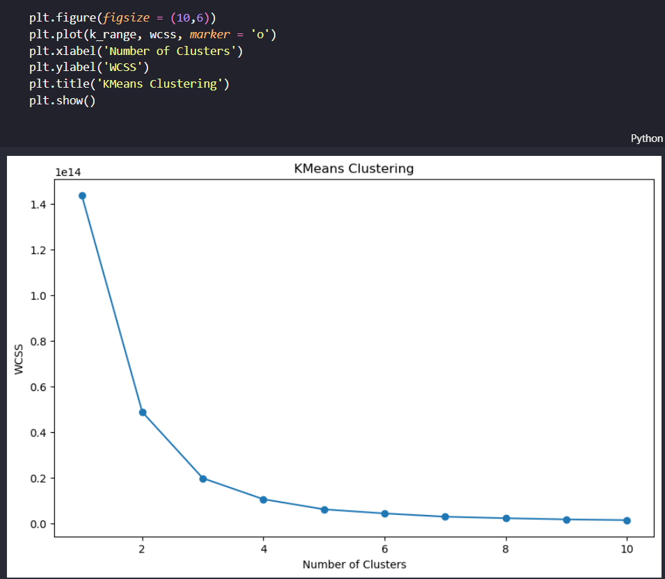
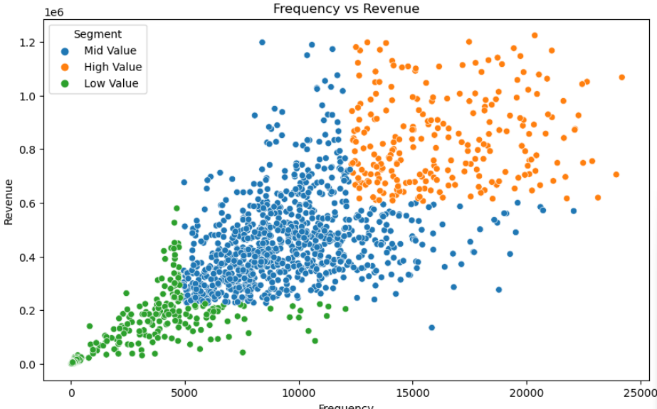

# Hackathon VPBank 🚀

In this project, we leveraged machine learning techniques to classify customer profiles and predict **Customer Lifetime Value (CLV)**.

  <a href="./images/VPBank_Hackathon_CLV_Team106.pdf" style="font-size: 18px; font-weight: bold;">🔗 View PDF</a>

---

## Technologies Used 🛠

- **AWS SageMaker**
- **AWS QuickSight**

---

## Customer Statistics with AWS QuickSight 📊

  

---

## Number of Customers by Type via AWS QuickSight 📈

  

> **Note:**  
> The source code provided here documents only the steps taken during the project development and includes some results captured at that time. The database is not included due to data security considerations.

---

## Demo Screenshots 🎥

For more detailed insights, please refer to the accompanying `.ipynb` files.

  <figure style="margin-bottom: 20px;">
    
    <figcaption align="center"><strong>K-means Clustering</strong> 🤖</figcaption>
  </figure>
  <figure style="margin-bottom: 20px;">
    
    <figcaption align="center"><strong>Model Predictions</strong> 📈</figcaption>
  </figure>
  <figure style="margin-bottom: 20px;">
    
    <figcaption align="center"><strong>Customer Segmentation Analysis</strong> 🔍</figcaption>
  </figure>

